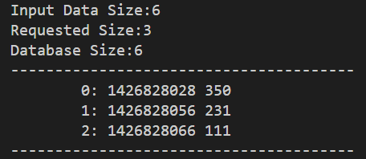
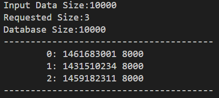
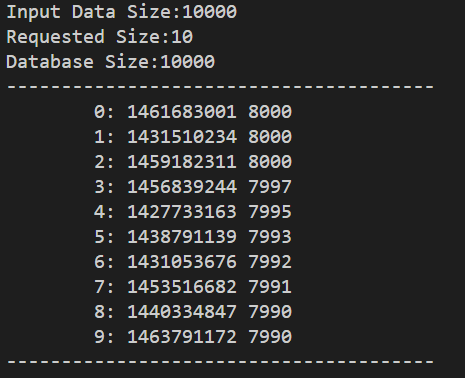
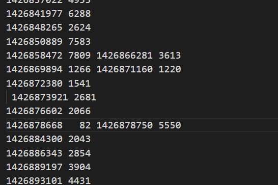
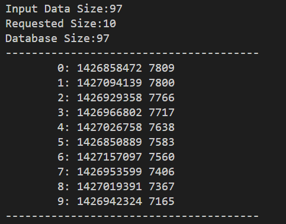
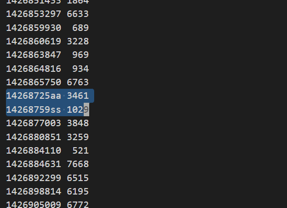
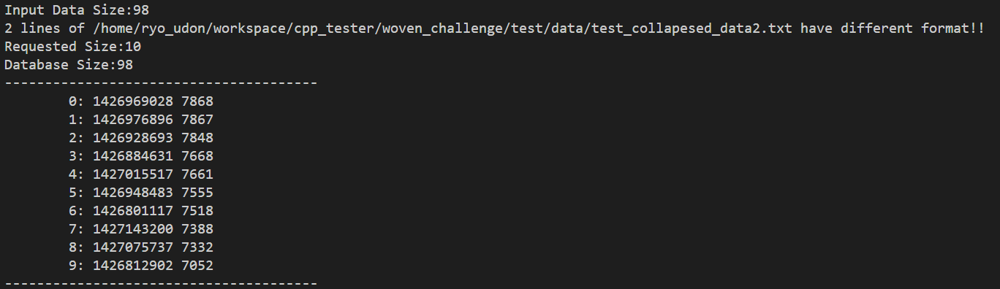

# 1. Woven Challenge

## 1.1. What is this project?

This project is to read below data format and print number of data that user selected.

Here is a quick example.

if you run below command, output will be like below image.

    ./bin/woven_challenge -f ./test/data/test1.txt -x 3

## 1.2. Required

Must have
- Ubuntu >20.04
- C++11 or more
- make  (sudo apt isntall build-essential)
- cmake (sudo apt install cmake)

Option
- Python3 (To create test data)

## 1.3. How to build

Inside of woven_challenge package looks as below.

    woven_challenge
    |- bin
    |- build
    |- include
    |- src
    |- test
    |   |- data
    |- CmakeLists.txt
    |- Readme.txt

### 1.3.1. Move to build directory

    cd /path/to/woven_challenge/build

### 1.3.2. Run cmake

    cmake ..

### 1.3.3. Run make

Binary file named "woven_challenge" will appear in "bin" directory after running make.

    make

## 1.4. How to use

Run "woven_challenge" in bin directory from anywhere you want.

For examle, if you want to run from build directory and below will be shown in your prompt.

    ./../bin/woven_challenge -f ../test/data/test1.txt -x 3

ofcourse, you can select absolute path for both binary file, and input file.

### 1.4.1. Run Options

3 options are prepared for you.

- -f: input data file. Absolute or Relative path (String)
- -x: output data size  (Integer)
- -h: show option list

## 1.5. Test List

### 1.5.1. (Test Case1) Expected format with small size, and set bigger output size.

Tested with small size data (only 1 data) and set option -x with bigger number.

    ./bin/woven_challenge -f /home/ryo_udon/workspace/cpp_tester/woven_challenge/test/data/test_small_data.tx
t -x 3

### 1.5.2. (Test Case2) Big Data(10000)

Tested with big size data(10000) and set option -x to 3 and 10

    ./bin/woven_challenge -f /home/ryo_udon/workspace/cpp_tester/woven_challenge/test/data/test_big_data.txt -x 3

    ./bin/woven_challenge -f /home/ryo_udon/workspace/cpp_tester/woven_challenge/test/data/test_big_data.txt -x 10

### 1.5.3. (Test Case3) Data with different Format

#### 1.5.3.1. (Pattern 1) Line breaks are removed

Tested with data that 3 line breaks are removed as below.

Result is as below.

3 lines with no line break are eliminated and imported as 97 line data.

#### 1.5.3.2. (Pattern 2) Data edited with alphabets

Tested with below txt that includes, alphabets in the data.

Result is as below. 2 lines with alphabets are removed, and imported as 98 lines data.

## 1.6. Future work

### Google Test

I've wanted to create some google test to test purse function and sort functions.

But I gave up because I need to write down additional document to setup google tests (apt get and so on).

### Docker Environment

I didn't prepare docker environment this time, because was not sure that docker is installed in the testing PC.

If docker is installed, I will make Dockerfile for that.
